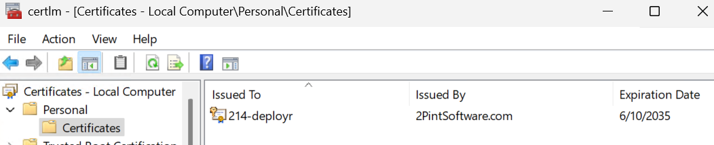

# DeployR Setup

This is my lab setup, super simple.

- Windows Server 2025 Standard
  - HyperV VM | 8GB RAM | C: = 120GB | D: = 400 GB (DeployR Content Items)
- Name: 214-DeployR
- FQDN: ....  I'm just using a WorkGroup, no Domain Join
- Certificates are from the 2PXE installation, more on that later.
- User Account (local): gary.blok - Full Admin - Used for all installs

## PreReqs

- MS Junk
  - ASP.Net Core 8.0.16
    - .NET RUntime
    - .Net Desktop Runtime
    - ASP.NET Core Runtime
  - MS ADK & WinPE (Latest)
  - PowerShell 7.4.X
  - SQL Express
    - Make sure you add NT AUTHORITY\SYSTEM to dbcreator role (in SSMS)
  - SQL Management Studio (Optional)
- Server Changes:
  - BC:

  ```PowerShell
  Install-WindowsFeature BranchCache
  ```

  - IIS

  ```PowerShell
  Install-WindowsFeature -Name Web-Server, Web-Windows-Auth -IncludeManagementTools
  ```
  
  - Firewall for DeployR:

```PoweShell
# Firewall rule 7281 (HTTPS) & 7282 (HTTP)
New-NetFirewallRule -DisplayName "2Pint DeployR HTTPS 7281" -Direction Inbound -LocalPort 7281 -Protocol TCP -Action Allow
New-NetFirewallRule -DisplayName "2Pint DeployR HTTP 7282" -Direction Inbound -LocalPort 7282  -Protocol TCP -Action Allow
```

- StifleR 2.14
  - Server
  - Dashboard

NOTE:  I installed 2PXE on the same server, which created self-signed certificates using the 2PintSoftware CA.  I then used Intune to push the 2PintSoftware CA Cert to all of my devices.
2Pint CA Cert located: "C:\Program Files\2Pint Software\2PXE\x64\ca.crt"

 I setup IIS to use the certificate in the


## StifleR Config File Changes

Under the IntegrationSettings area:

- DeployR full URL: <https://214-DeployR:7281/v1>
  - Update because LOCALHOST doesn't match the cert. :-)
- Everything else should just be standard settings for StifleR

## DeployR Config File Changes

- CertificateThumbprint = the Thumbprint you're using for HTTPS in IIS
- ConnectionString = Server=.\SQLEXPRESS;Database=DeployR;Trusted_Connection=True;MultipleActiveResultSets=true;TrustServerCertificate=True
- ContentLocation = D:\DeployRContentItems | Set this to what works good for you, I setup a separate volume just for the content, which I'll enable deduplication on.
- ClientURL = https://214-DeployR:7281
- JoinInfrastructure = TRUE (turned On)
- StifleRServerApiURL: https://214-DeployR:9000

## Post Installation

So once you get to this point, you'll want to make sure the services are all running, and you can pull up DeployR in the Dashboard.  Then it's time to build some boot media.


### Boot Media

Prep...

I made mods to my script, I'll upload it later.