# iPXE - Setup Alias Name for Server

## Changes required overview

- Added DNS Alias
- Updated Config Files
  - 2Pint.2PXE.Service.exe.config
  - iPXEAnywhere.Service.exe.config
- Certficates
  - Cleanup: C:\ProgramData\2Pint Software\2PXE\Certificates
  - Cleanup: Original Self-Signed Cert in My Computer Certs

## Lab Setup

I setup a new VM and followed the "iPXEStandaloneSetup" Guide.  Once it was all setup, I started to make the modifications.  Here is a list of how things are setup:

- HyperV VM: 4GB RAM | 120GB Storage | Server 2025
- Network: 192.168.214.7
- DNS: 192.168.20.2 (Domain DNS)
- Name (FQDN): 214-iPXE-Alias.2p.garytown.com
- DNS Alias: iPXE.2p.garytown.com
  
## Modifications

I'll cover each of the different items below in a bit more detail than the overview

### DNS Alias

So for this, I followed the iPXE Standalone Guide, setup a new Windows Server Standard 2025 named 214-iPXE-Alias.  I then went into DNS and created an Alias called 'ipxe' for it.

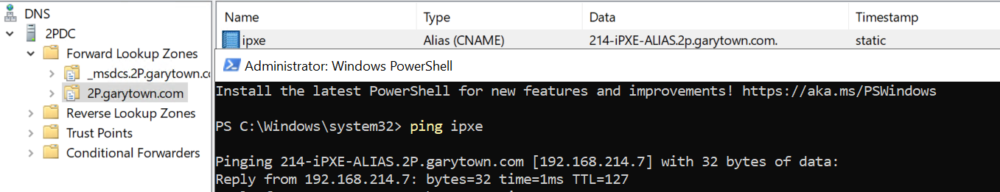

### Configuration Files

#### 2PXE Config

"C:\Program Files\2Pint Software\2PXE\2Pint.2PXE.Service.exe.config"

Find the value for ExternalFQDNOverride and set it,  Before & After:

```XML
<add key="ExternalFQDNOverride" value=""/>
<add key="ExternalFQDNOverride" value="ipxe.2p.garytown.com"/>
```
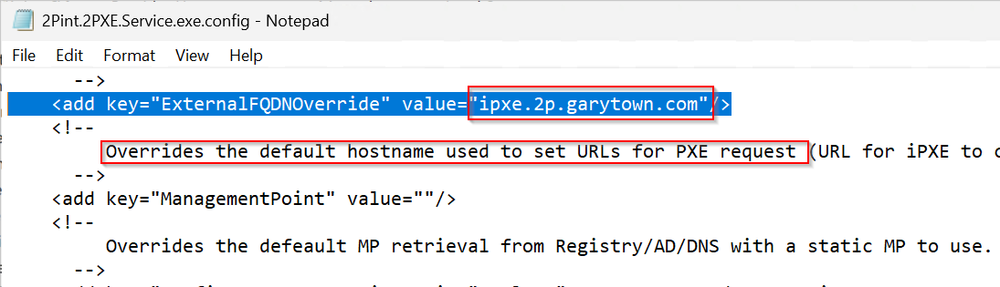

#### iPXE WS Config

"C:\Program Files\2Pint Software\iPXE AnywhereWS\iPXEAnywhere.Service.exe.config"

This one doesn't have the setting there to populate, so you'll need to copy it in from the other configuration file.  I added the comments as well:
```XML
    <add key="ExternalFQDNOverride" value="ipxe.2p.garytown.com"/>
    <!--
         Overrides the default hostname used to set URLs for PXE request (URL for iPXE to connect to) as well as request to get data from if this is a DP.  Set to "" if not in use, which then uses default FQDN hostname.
      -->
```

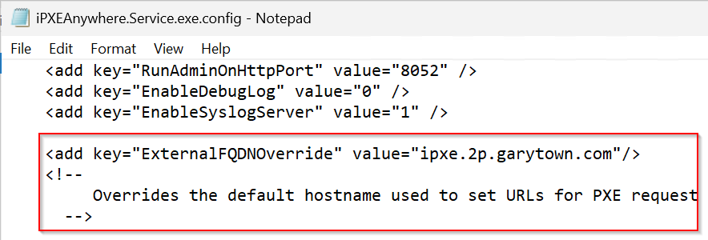

### Certificates

Here are the certificates auto generated with the default names:

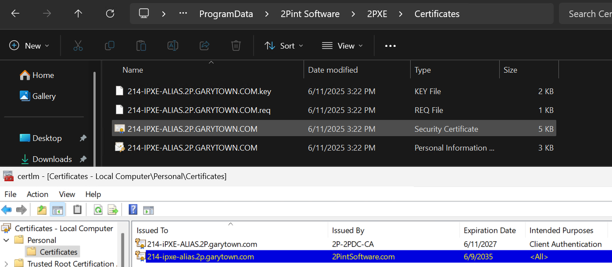

Those are no good, as they are the wrong server name, we need to have them show as ipxe.2p.garytown.com.  So we'll go ahead and delete all of these, then restart the 2PXE service and the iPXE Anywhere service after.

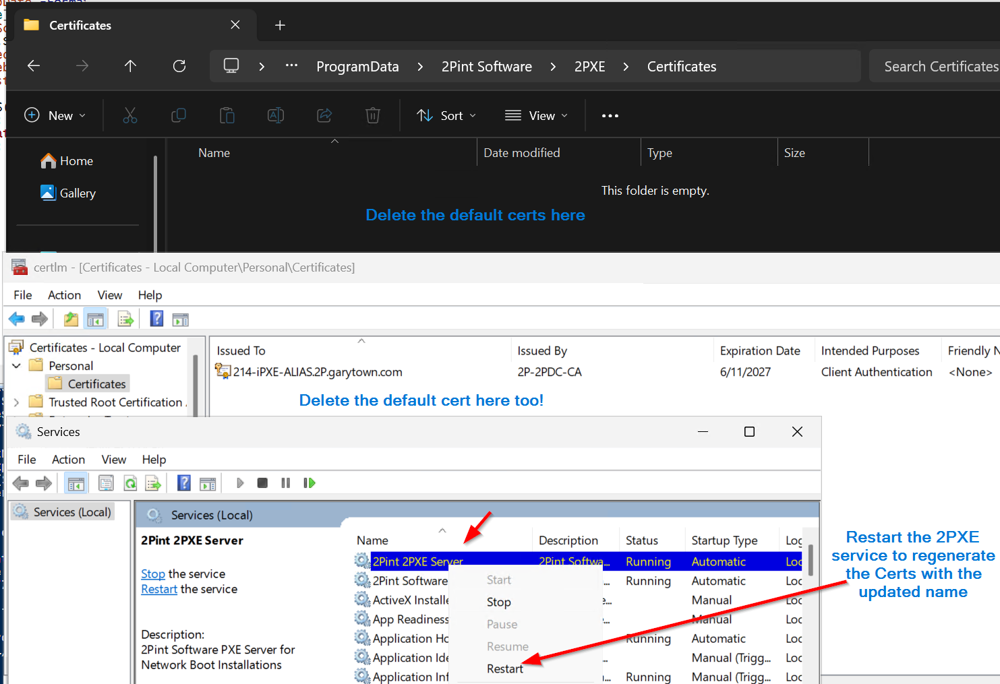

Once the service restarts, you'll see the items be repopulated with the updated name that is is now pulling from the ExternalFQDNOverride value.

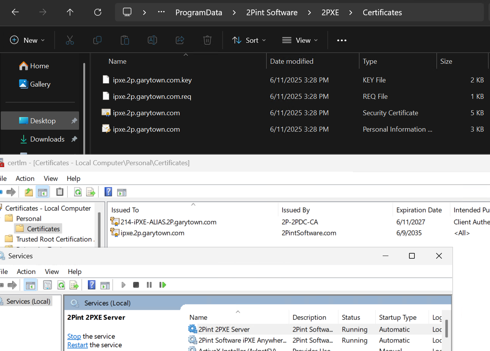

### IIS Certficate

Reminder, you'll want to go into IIS and update the binding on the SSL 443 certificate to use the new one you just created with the updated Alias name.  For me, when I deleted the old Cert, IIS just reverted to "Not selected", so I had to update that to use the new name cert, restart IIS, and confirmed in browser that it's all looking good.

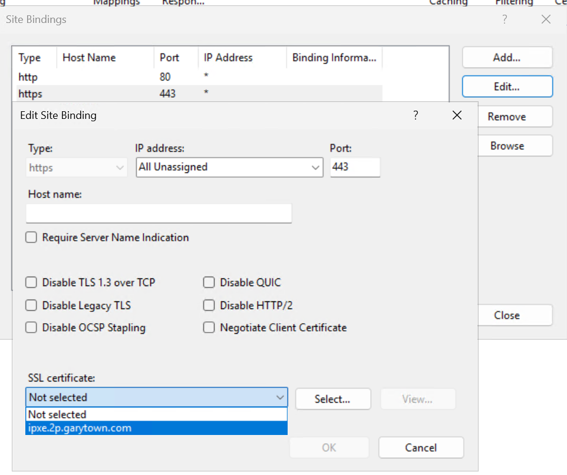
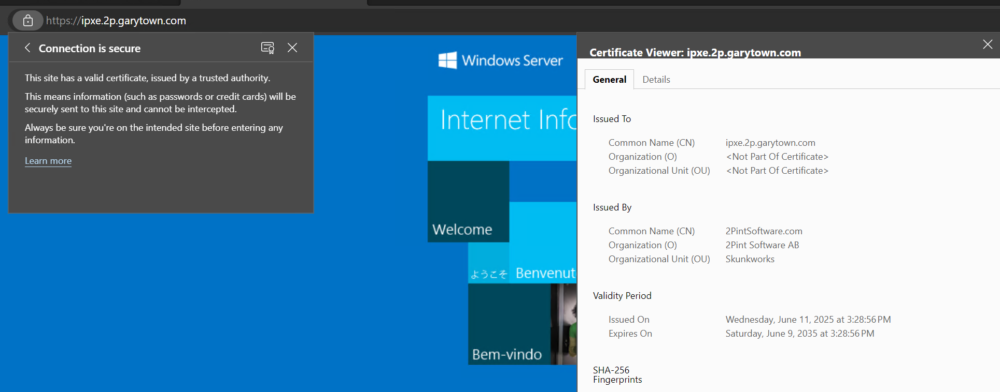

## Test Time

Booting to Network, it's grabbing an IP, and sees our server with 192.168.217.7 then it starts to pull from our DNS Alias name.
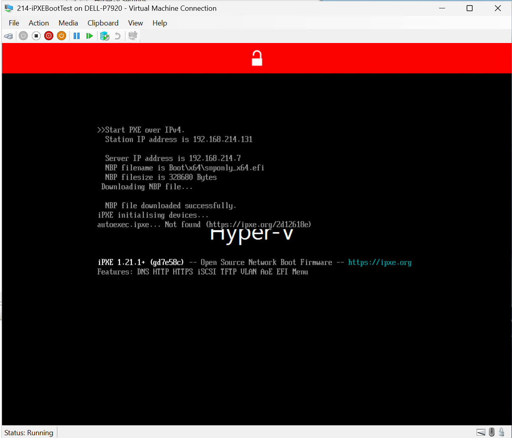
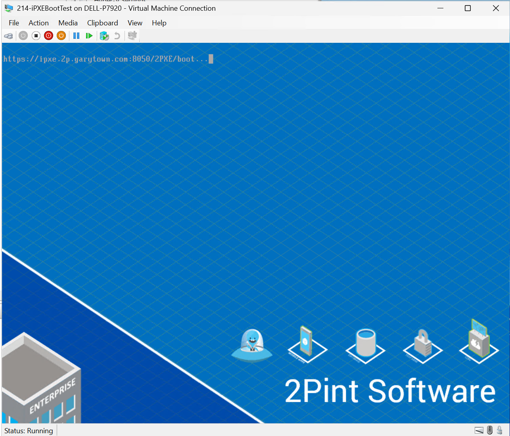
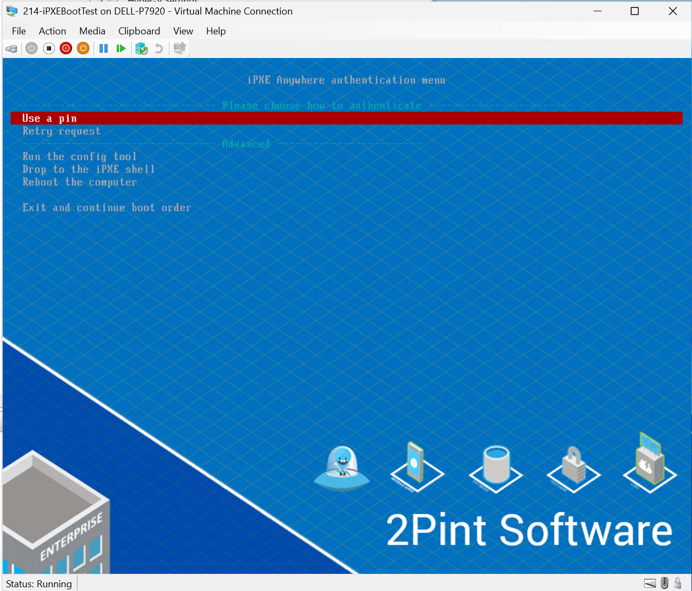

## Troubleshooting

Some potential issues you might see along the way.  Things to check

- Make sure both services are running.  If it's not running, something is misconnfigured
  - Double check the configuration files for the service that isn't starting.  Revert to older copy if possible, then figure out what changed that is breaking the server from starting.
- Make sure the Certificates are set properly

### Config File Issues

Syntax is really important, when I was doing this, I copy / paste wrong and missed a character, and the service wouldn't start.  

Other things, Port Numbers.  I sometimes forget to add port numbers, then things don't work well.  Example: iPXEAnywhereWebServiceURI, I had forgot to add the port number.  Here is what I had it set to, and what I had to updated it to:

```XML
<add key="iPXEAnywhereWebServiceURI" value="https://ipxe.2p.garytown.com"/>
<add key="iPXEAnywhereWebServiceURI" value="https://ipxe.2p.garytown.com:8051"/>
```
How the issue presented itself in the 2PXE log:
```
iPXE web Service enabled but no valid response from server:https://ipxe.2p.garytown.com, reason: NotFound
```
From the endpoint:
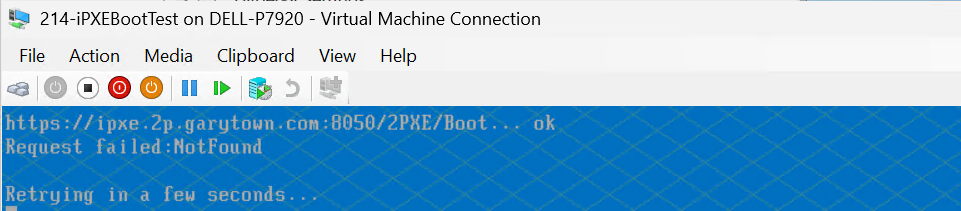

On the server, running service interactively:
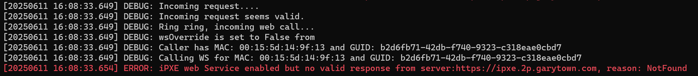

As soong as I added the port number and restarted the services, it started working.

### Certificate Issues

Before I added the ExternalFQDNOverride value into the iPXE Webservice configuration file, I was getting this error:

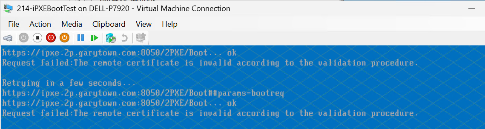

So even though I had it in the 2PXE file, it wasn't in the iPXE WS config, and it caused problems.  It would then generate extra certficates, and try to use those.

Here you can see the extra certificates it was making:
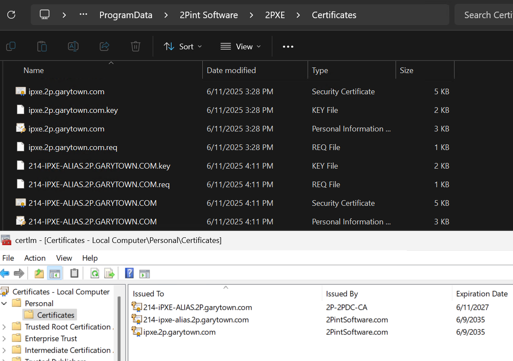

To resolve, I stopped both services, cleaned up the certs I didn't want, which were the ones that had the actual name of the PC instead of the Alias, fixed the iPXE Configuration File, and started both services.  Then everything worked.

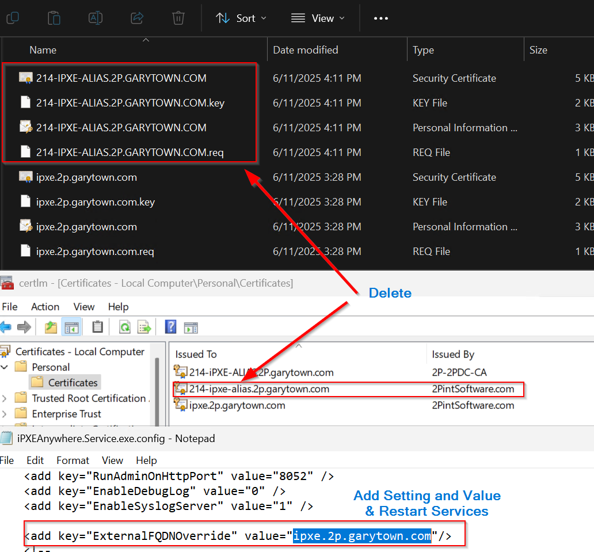

After you restart the services, those should NOT auto generate and it should use the proper alias based certificates.

