# Setting up iPXE Anywhere WebService Reports

I recently setup the 3 reports 2Pint offers for the Webservice to go along with the data it's collecting into the database.  If you've followed my pervious guides, this will fill continue on from there.

## Lab Setup

I setup a new VM and followed the "iPXEStandaloneSetup" Guide.  Once it was all setup, I started to make the modifications.  Here is a list of how things are setup:

- HyperV VM: 4GB RAM | 120GB Storage | Server 2025
- Network: 192.168.214.7
- DNS: 192.168.20.2 (Domain DNS)
- Name (FQDN): 214-iPXE-Alias.2p.garytown.com
- DNS Alias: iPXE.2p.garytown.com

From the previous guide, you'll already have your SQL Express Database setup and be able to iPXE boot devices.

Things we'll need to do now are download and install SQL Server Reporting Services (SSRS), install the 2Pint reports, and do some minor configuration.

### Setup SQL Service Account for SSRS

This account will be your Execution Account which you'll set in the Report Server Configuration, and on your data sources, which we'll cover when we get there.

Username: iPXE_SSRS

Feel free to make whatever user name you want.

## Setup the Reports

### Install SSRS

I found the download here: <https://www.microsoft.com/en-sg/download/details.aspx?id=104502>

I then ran through the wizard, making sure to choose Express!


I left everything else default and let it install


Lets go ahead and configure this!


### Configure SSRS

It should figure out the defaults, go ahead and click connect:


Service Account, Leave Default:


Web Service URL, update HTTPS and pick your cert:


Hit apply, let it go for a moment, you will probably see something like this, just ignore it for now, click OK.


On Database, click "Change Database", then let it "Create a new report server database"


Make sure you add "SQLEXPRESS" to your server name:


Database, Credentials can be left as defaults, and your summary will look similar:


Click Next and wait for awhile then click Done:


On the Web Portal URL, leave defaults and click Apply!  Ignore the warning and click OK


Add the Execution Account info and then click Apply


### Quick Browser Test

If you're using an Alias, test from another machine, if you're using the hostname, then you can test on the local host, but it's always a good idea to test from another machine, this threw me for a loop.

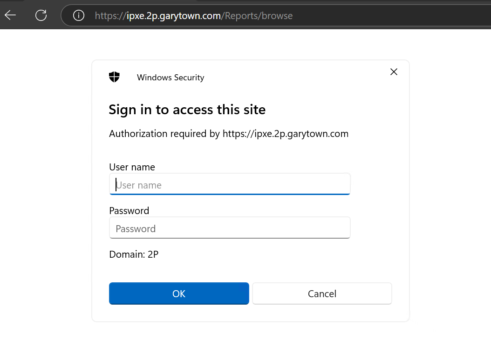
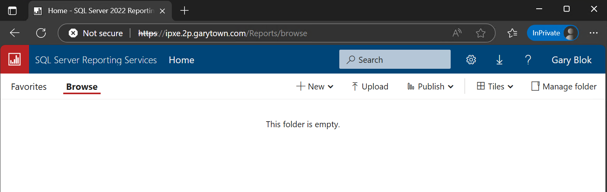

So I get prompted for credintials, and then it shows up.  The Certificate used is self-signed by 2Pint, so unless you've trusted it, you'll see the "Not secure".  If you setup SSRS on another server, and use your own CA Certs, then this isn't an issue.  Otherwise you can use different ports like 4433, etc, and use one of your CA Certs.  Anyway, I'll leave that up to you and your Cert team.

### Adding Reports

Now that we have it setup, we just need to add some Reports, and 2Pint provides 3 reports out of box.... on GitHub.

You can grab them here:
<https://github.com/2pintsoftware/2Pint-iPXEAnywhere/tree/main/Reports/SRSS%202014%20Reports>

You'll need all 4 files, then you run the PowerShell Script:
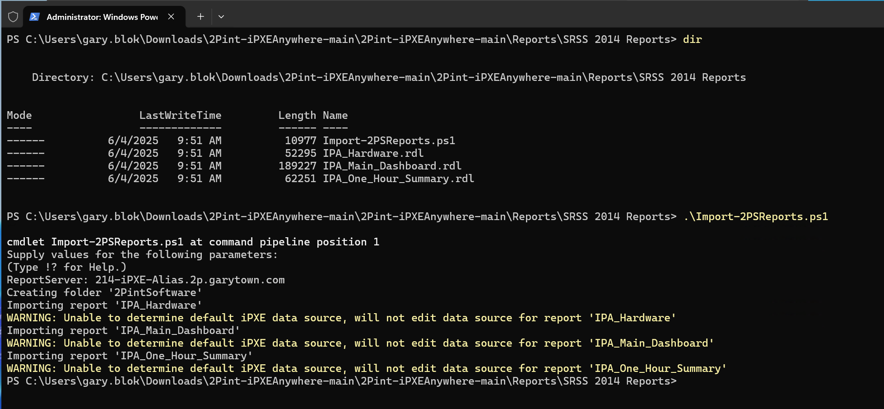

You'll see that it gives a few warning, take no mind of that, we'll fix it manually by going in and creating the data source.

### Creating the Data Source for SSRS Reports

Before we can setup the Data Source, we first need to modify a few SQL Settings:

- Enable Protocol TCP/IP
- Enable and set SQL Server BRowser to Automatic, then Start.

#### SQL Server Configuration Manager

Enable TCP/IP in SQL Server Configuration Manager -> SQL Server Network Configuration -> Protocols for SQLEXPRESS:


After:
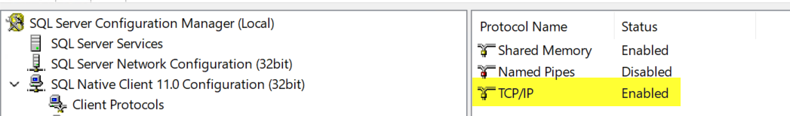

Now set the SQL Server Browser service to Automatic, and Start the Service:

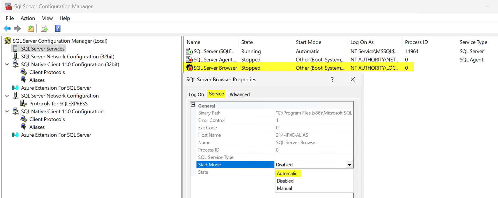
After:
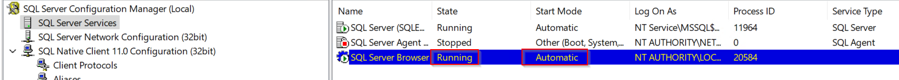

#### Create Datasource in Browser

Ok, so now when  you go into the browser, you should see a 2PintSoftware folder, drill into that.  Then click New. Then Choose Data Source.

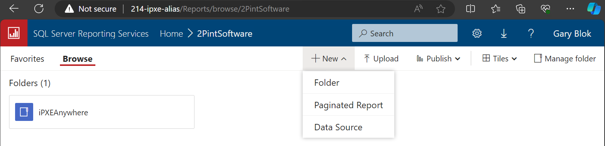

Once you're on the page, lets setup some things:

- Name: iPXEAnywhereDB
- Description: Datasource for 2Pint Software iPXE Reports
- Type: Microsoft SQL Server
- Connection String:

``` TXT
Persist Security Info=False;Initial Catalog=iPXEAnywhereDB;Data Source=214-ipxe-Alias.2P.garytown.com\SQLEXPRESS;Encrypt=true;TrustServerCertificate=true
```

- Modify the string to match your Server Name.  If you have a certificate setup for SQL, you can change TrustServerCertificate to False instead.  By setting it to true, we're just using the self-signed.

I'm first testing with my own account, which has admin rights on the machine, so I know it will make a connection to the database, but my goal is to switch over to the execution service account.

Test with My Account:

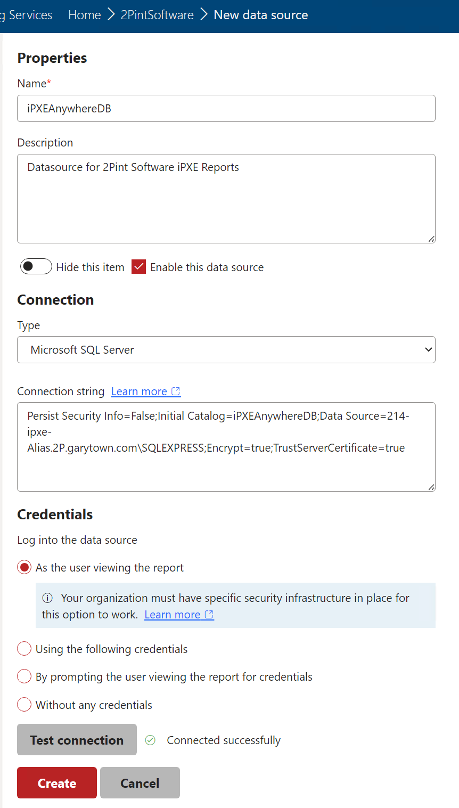

That looks good, lets try with my service account... and FAIL!

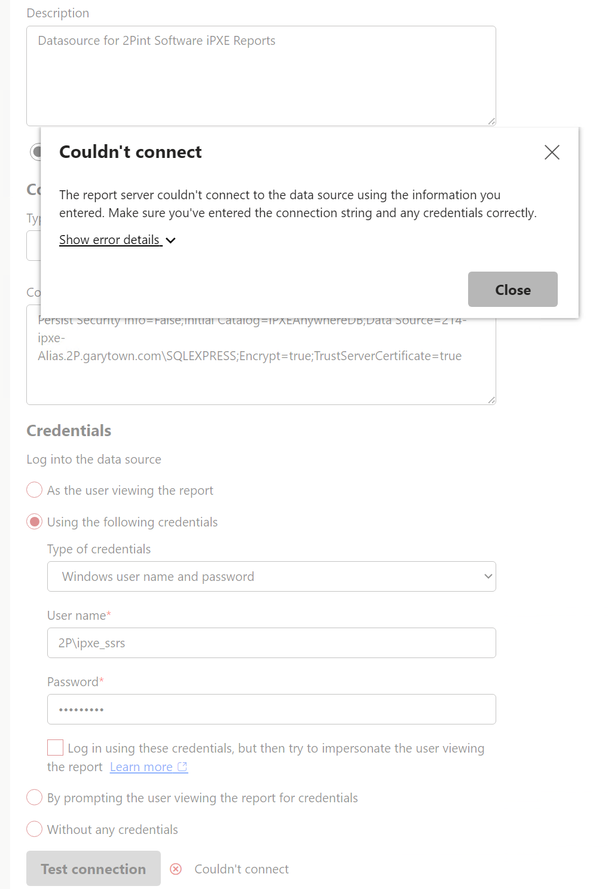

Lets head over to SSMS to see if we can resolve this where I'll add the user into Security -> Logins, and add a User Mapping of the iPXEAnywhereDB Database with public access and db_datareader

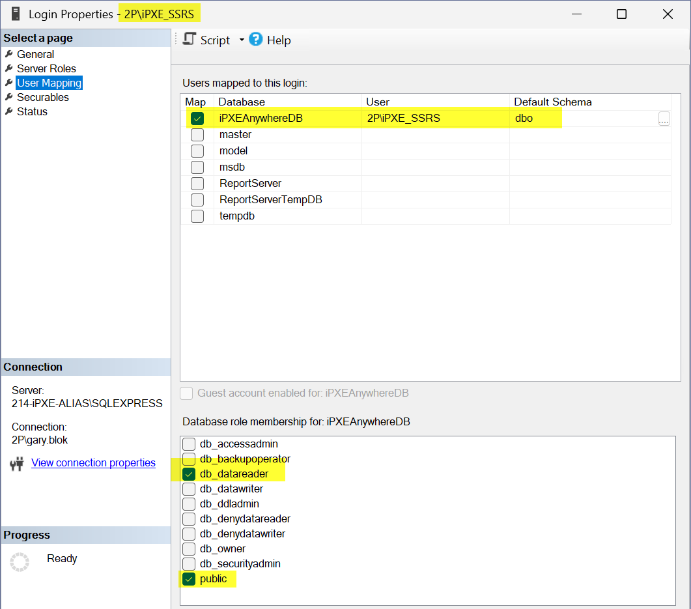

Lets go back and test connection again... yippee!  Test is good, so click Create

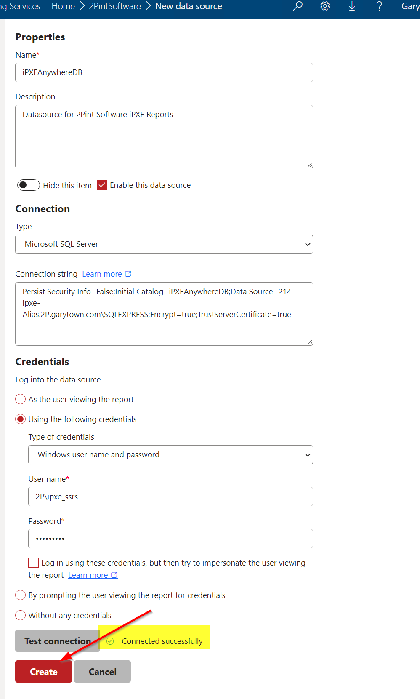

Now you'llsee the iPXEAnywhere Folder and the iPXEAnywhereDB Data Source.

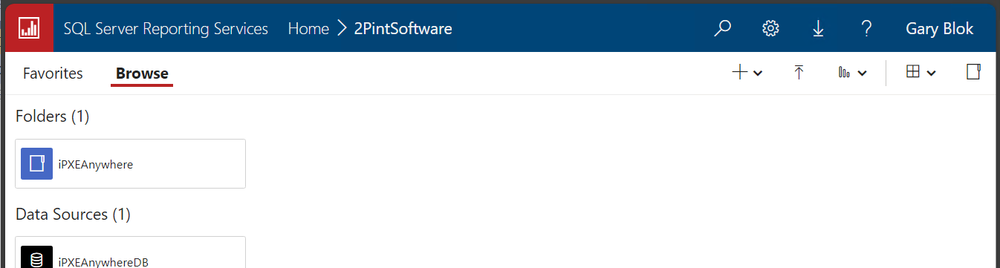

#### Update the Reports Data Source

Go into the iPXEAnywhere folder, pick the IPA_Hardware report, click the 3 dots (...) and choose Manage, then Data sources on the left, chose "A shared data source and click the three dots (...) drill down to find the datasource you just created and click save.

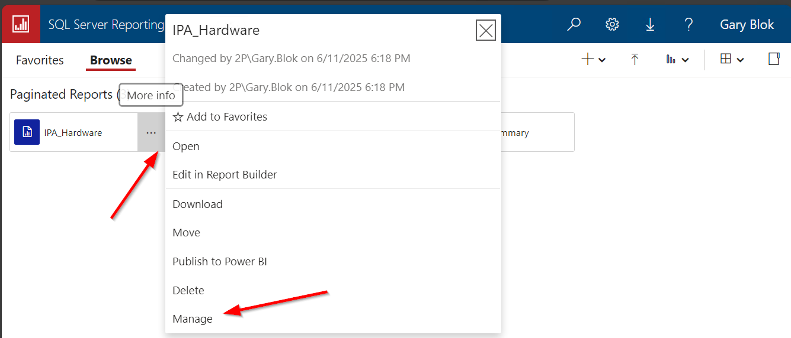
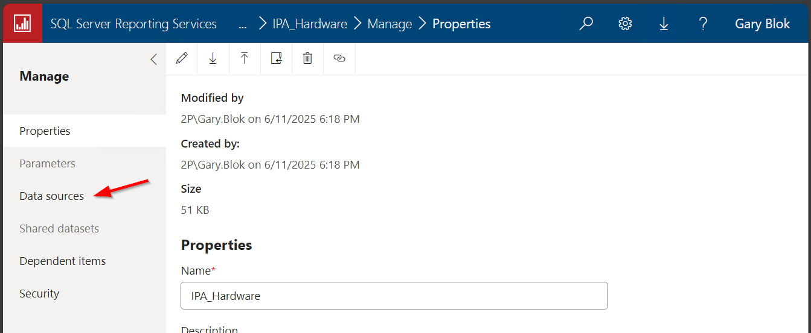
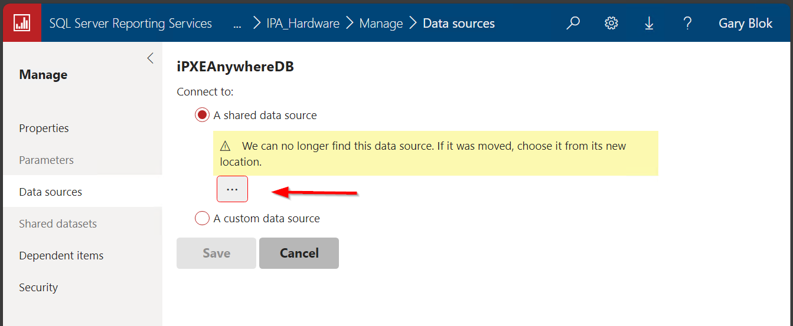
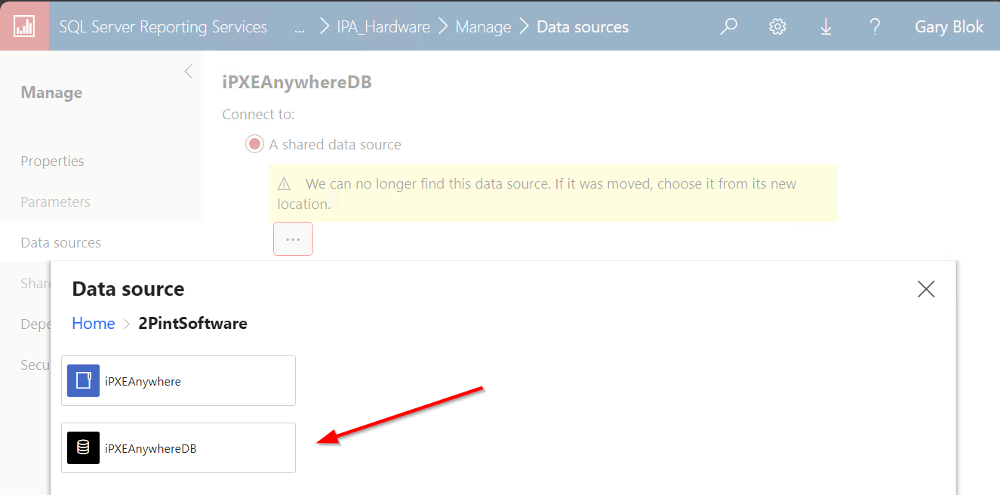
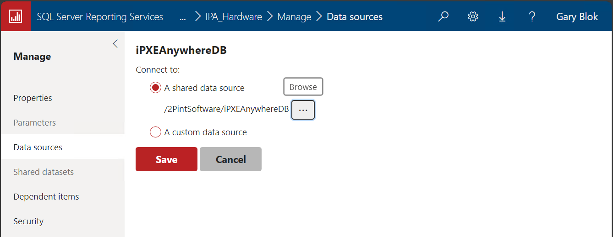


Now you can test the Report, just for warning, I just created this server and did one test, so don't expect a lot of cool visuals here, in fact, it's showing just my one VM.

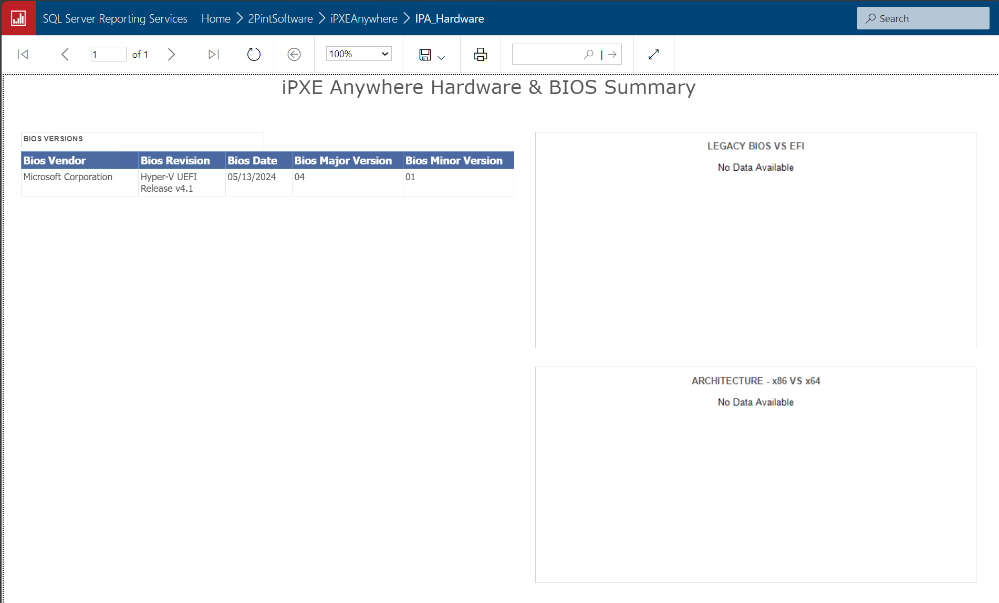

Now repeat that process for the next report, IPA_Main_Dashboard

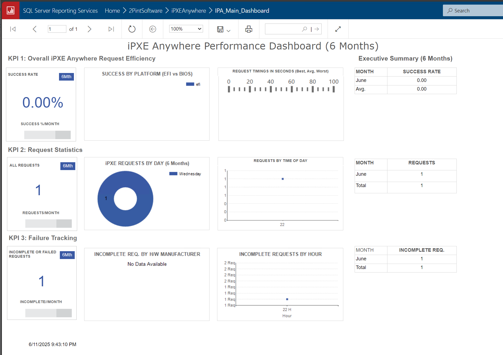

Now repeat that process for the next report, IPA_One_Hour_Summary:

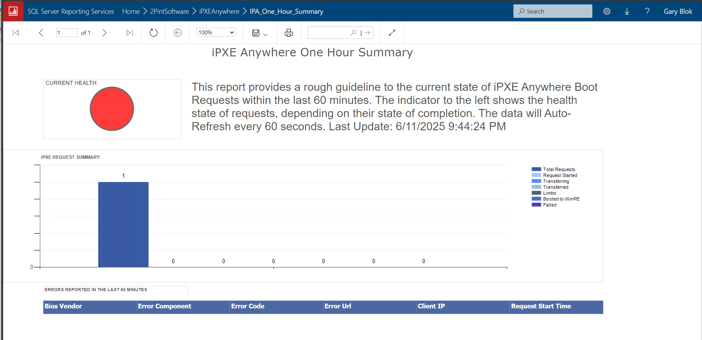


## Review

Ok, at this point you should have the reports working.  As you use iPXE more to boot devices and image or whatever you're going to do with them, more and more data will get entered into the database and your reports will get slightly more interesting.

The data will continue to grow in your iPXEAnywhere database, and if you're good with SQL or report builder, you'll be able to do some more creative reporting.  

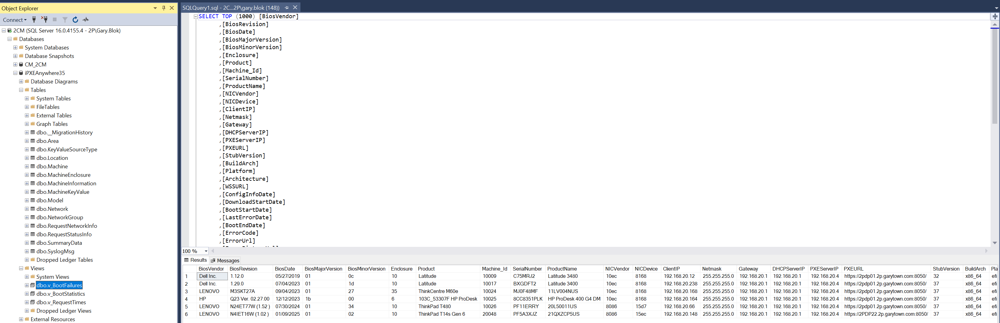

If I build any more reports, I'll list them here and provide links, and if any customers share ones they don't mind giving out, I'll post them as well.