# Setting up iPXE Anywhere WebService Reports

NOTE: WORK IN PROGRESS

THIS GUIDE DOES NOT WORK YET

I recently setup the 3 reports 2Pint offers for the Webservice to go along with the data it's collecting into the database.  If you've followed my pervious guides, this will fill continue on from there.

## Lab Setup

I setup a new VM and followed the "iPXEStandaloneSetup" Guide.  Once it was all setup, I started to make the modifications.  Here is a list of how things are setup:

- HyperV VM: 4GB RAM | 120GB Storage | Server 2025
- Network: 192.168.214.7
- DNS: 192.168.20.2 (Domain DNS)
- Name (FQDN): 214-iPXE-Alias.2p.garytown.com
- DNS Alias: iPXE.2p.garytown.com

From the previous guide, you'll already have your SQL Express Database setup and be able to iPXE boot devices.

Things we'll need to do now are download and install SQL Server Reporting Services (SSRS), install the 2Pint reports, and do some minor configuration.

### Setup SQL Service Account for SSRS

This account will be your Execution Account which you'll set in the Report Server Configuration, and on your data sources, which we'll cover when we get there.

Username: iPXE_SSRS

Feel free to make whatever user name you want.

## Setup the Reports

### Install SSRS

I found the download here: https://www.microsoft.com/en-sg/download/details.aspx?id=104502

I then ran through the wizard, making sure to choose Express!

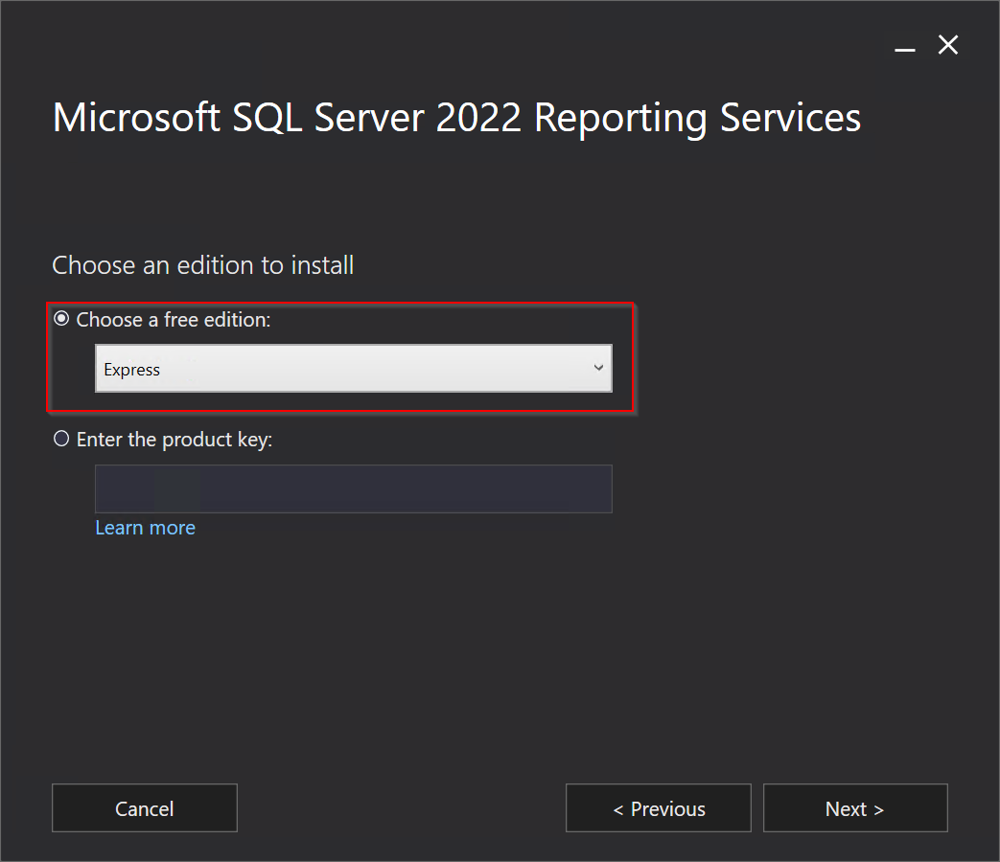
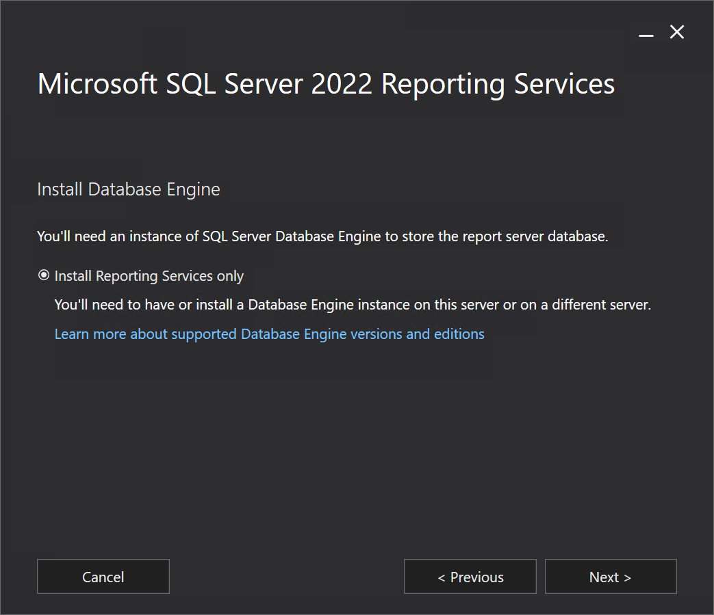

I left everything else default and let it install

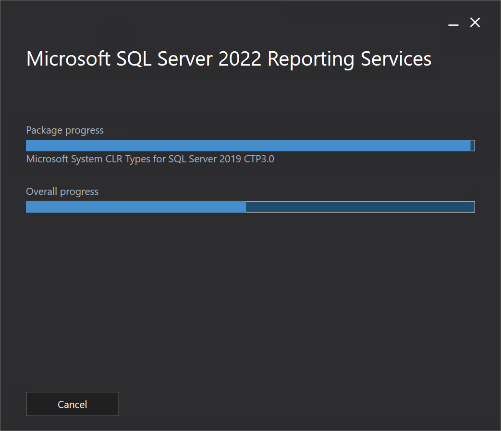

Lets go ahead and configure this!

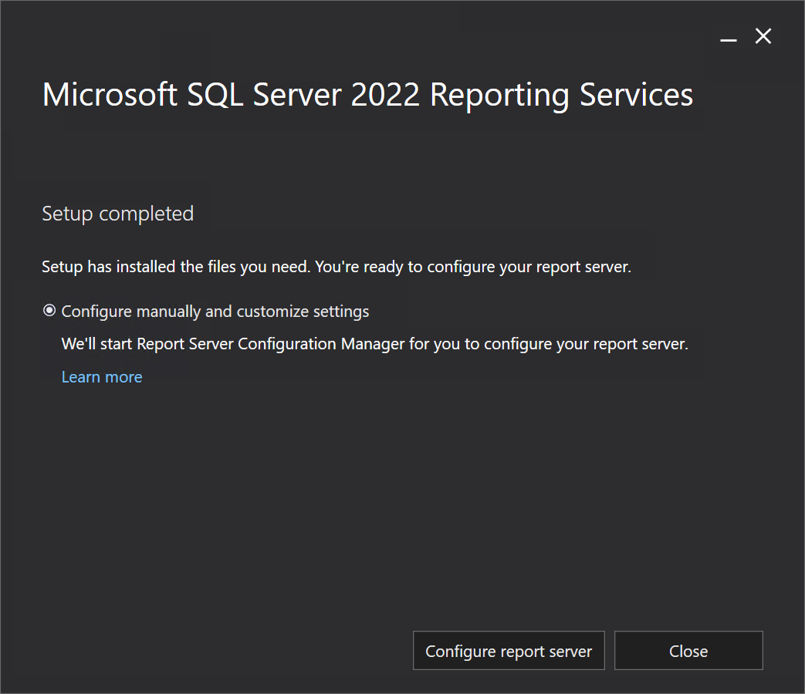

### Configure SSRS

It should figure out the defaults, go ahead and click connect:

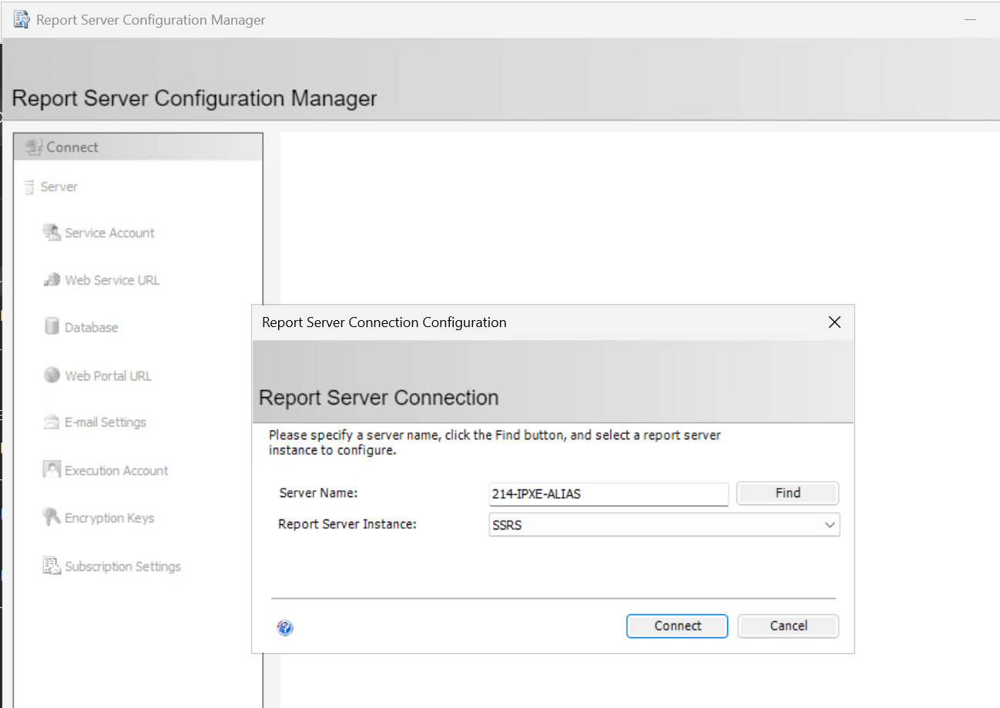

Service Account, Leave Default:
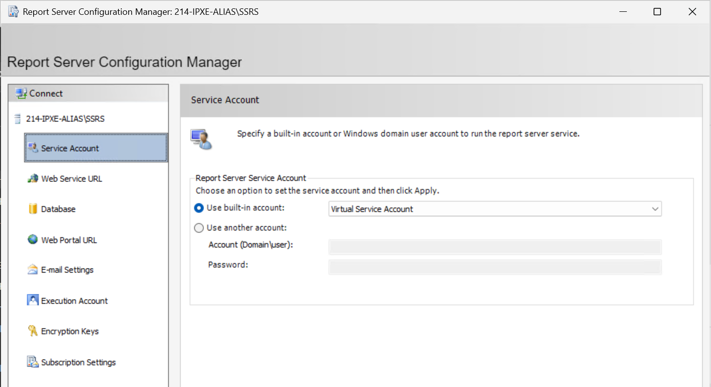

Web Service URL, update HTTPS and pick your cert:
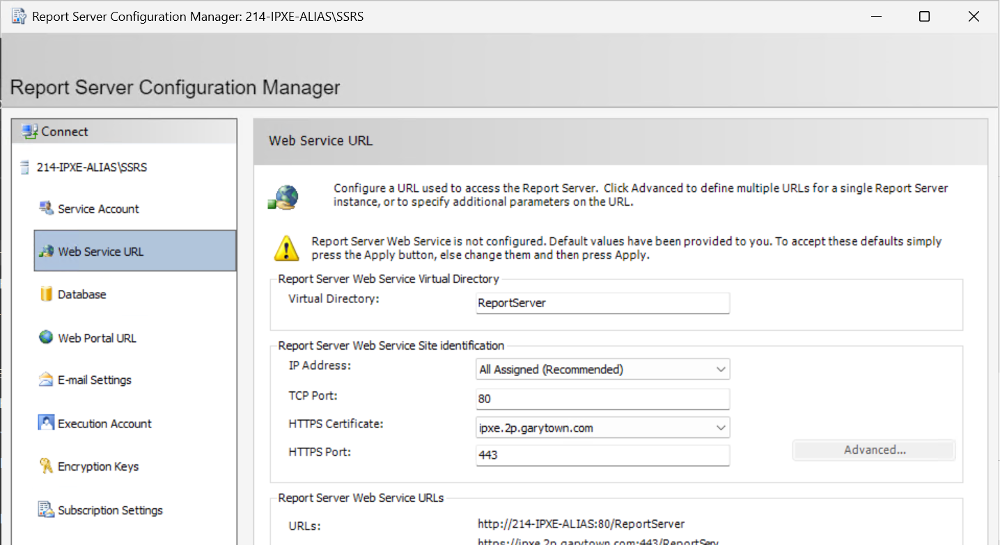

Hit apply, let it go for a moment, you will probably see something like this, just ignore it for now, click OK.

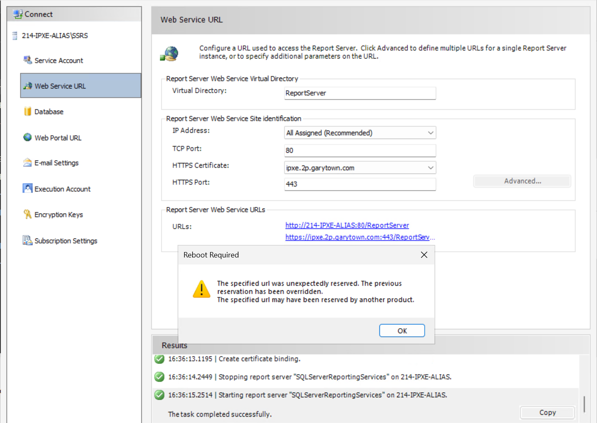

On Database, click "Change Database", then let it "Create a new report server database"

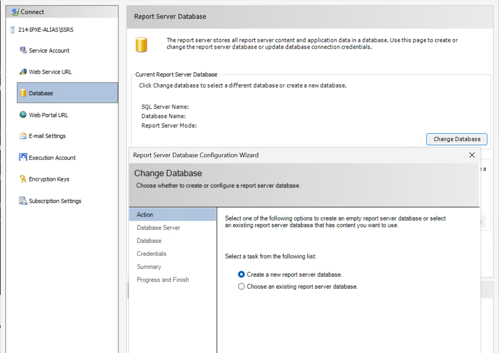

Make sure you add "SQLEXPRESS" to your server name:

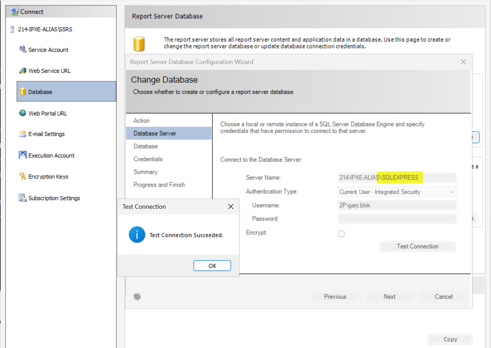

Database, Credentials can be left as defaults, and your summary will look similar:

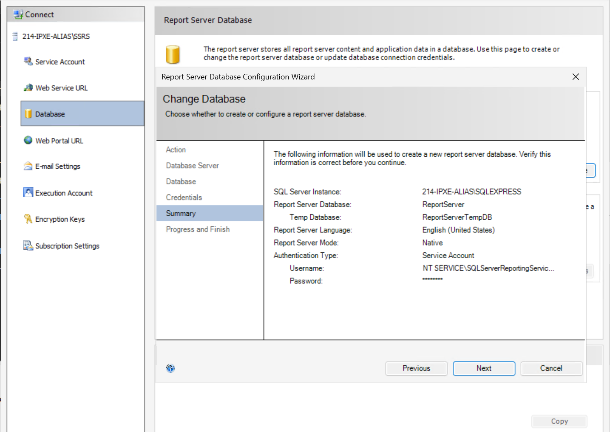

Click Next and wait for awhile then click Done:

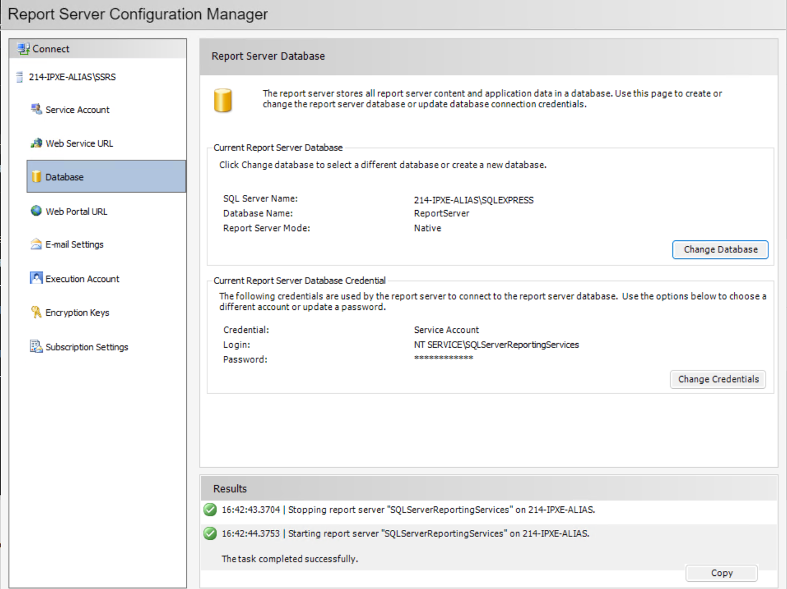

On the Web Portal URL, leave defaults and click Apply!  Ignore the warning and click OK

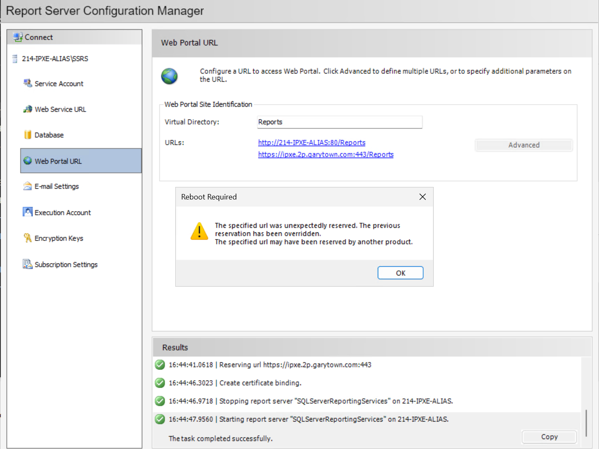

Add the Execution Account info and then click Apply

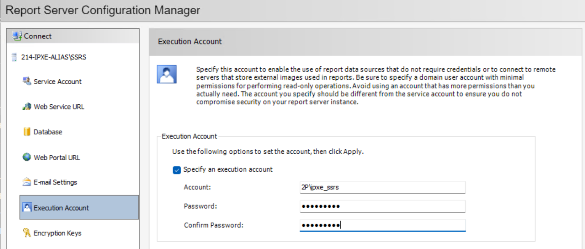