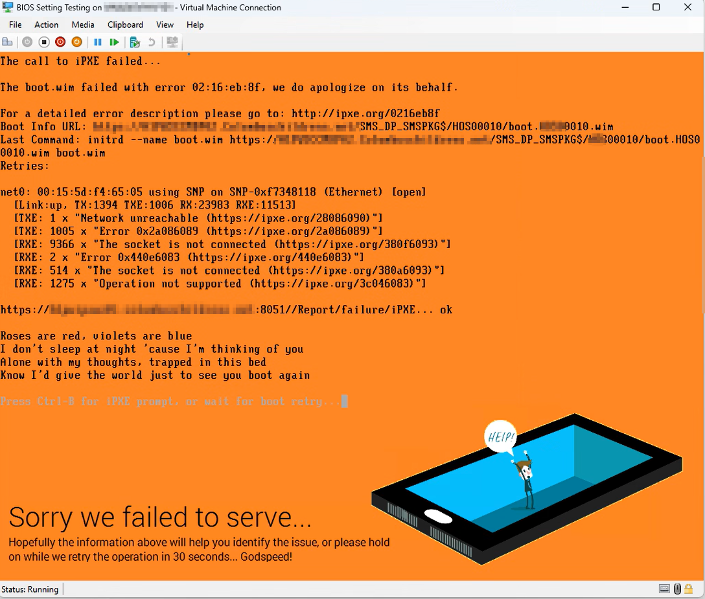
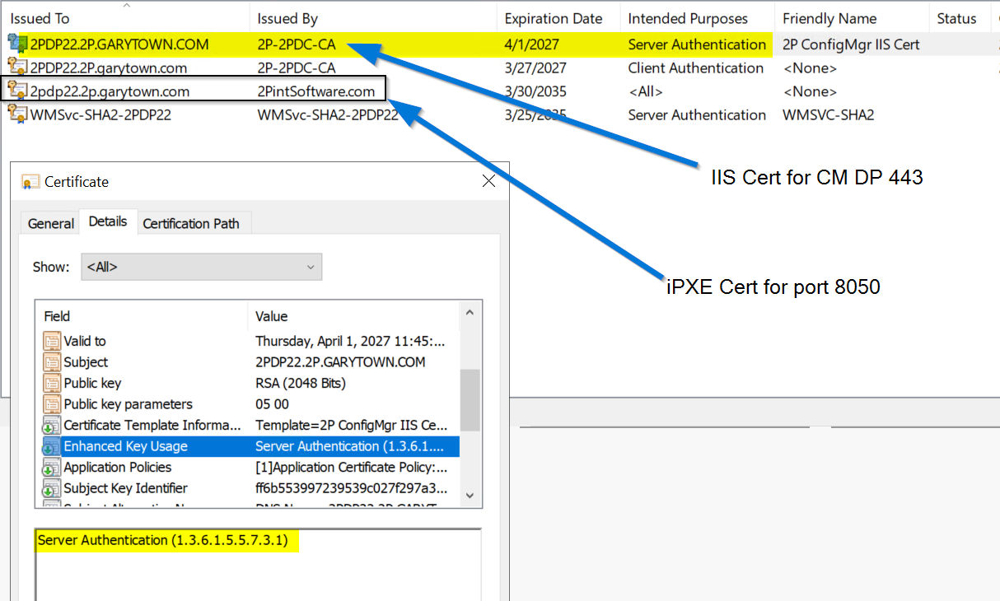
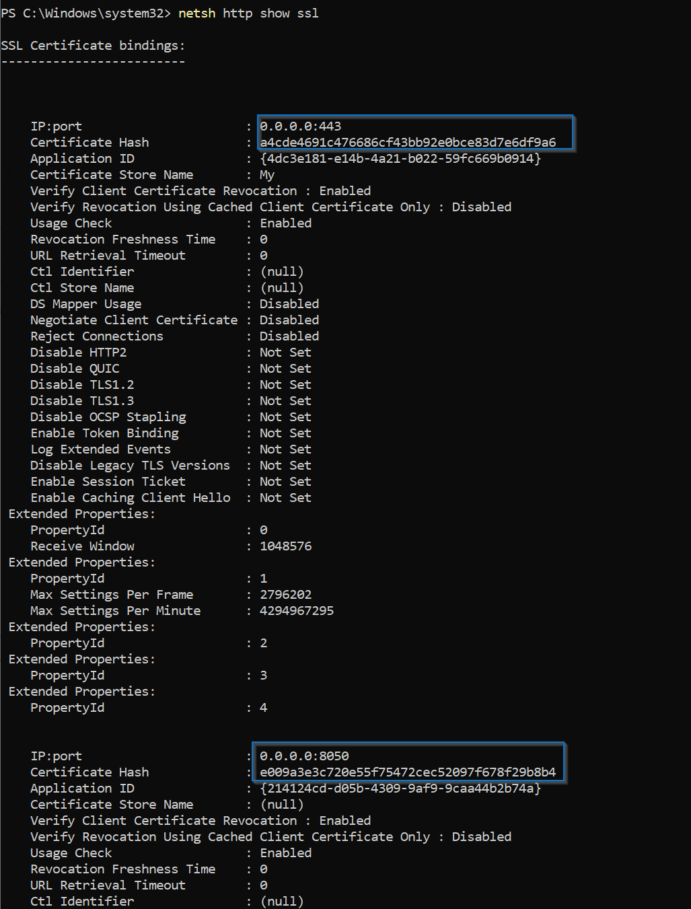

# iPXE Troubleshooting

A page of my lessons learned while assisting folks with iPXE

## Config Mgr Integrated iPXE

This section will be specific to issues that happen when integrated with ConfigMgr.

### Fails to download Boot WIM from DP: Error 02:16:eb:8f

This error lead us down to determine it was a certificate issue.  Everything looked right until we looked at the Enhanced Key Usage, and it had two entries instead of just 1.  It had both Server Authentication and Client Authentication.  Once the cert was regenerated with ONLY Server Authentication, it worked as expected.


How it's supposed to look:


#### Confirm the Certificates were assigned to the correct ports:

Using this command, we can see the Ports enabled for https, and the thumbprint of the associated certificate, you can then compare the thumbprint to confirm.

``` command prompt
netsh http show ssl
```


